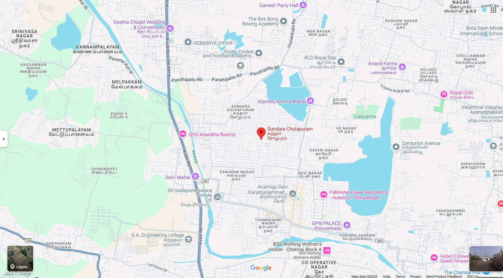
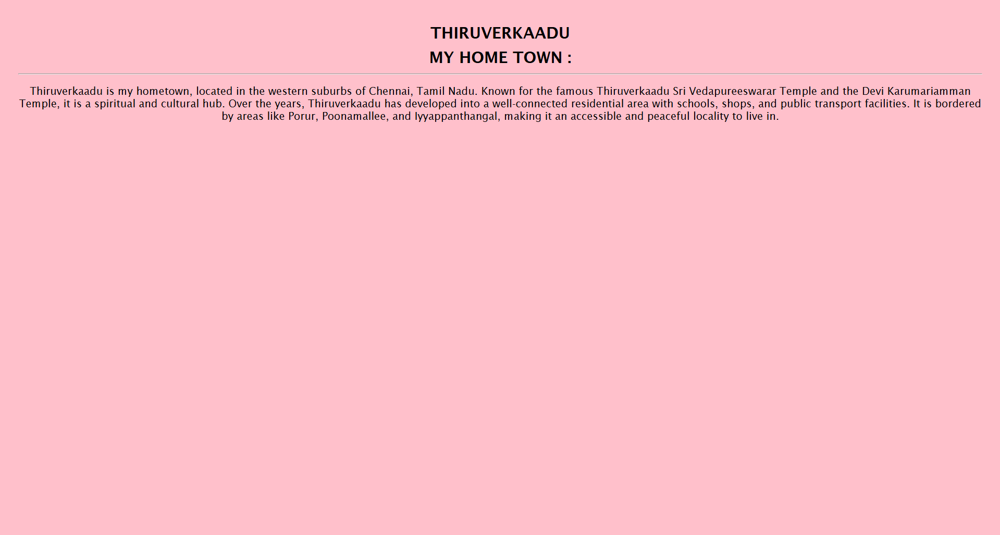
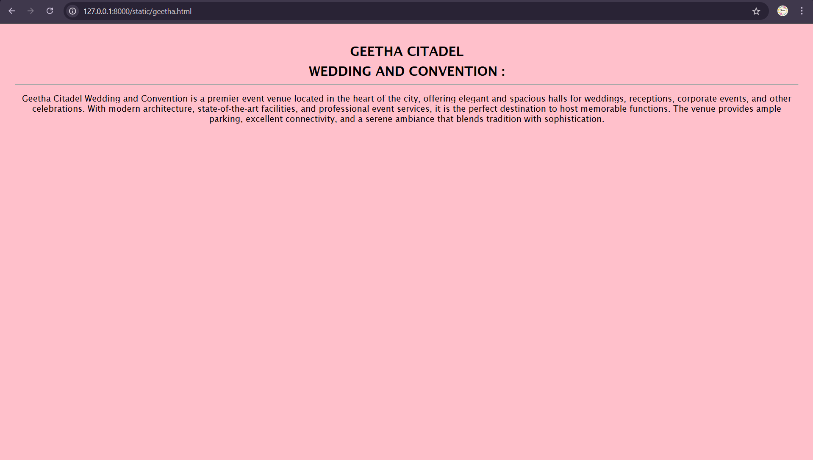
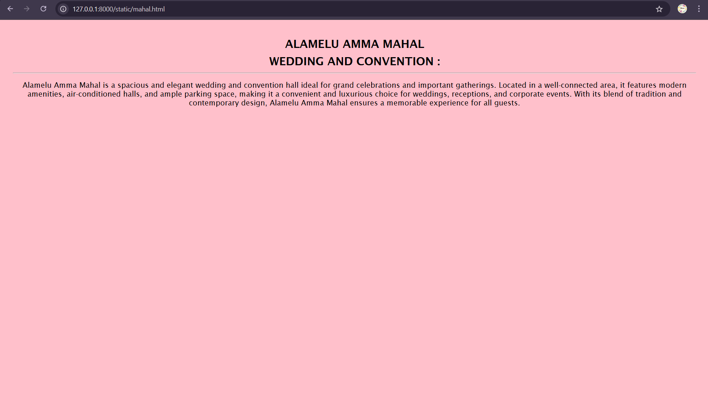
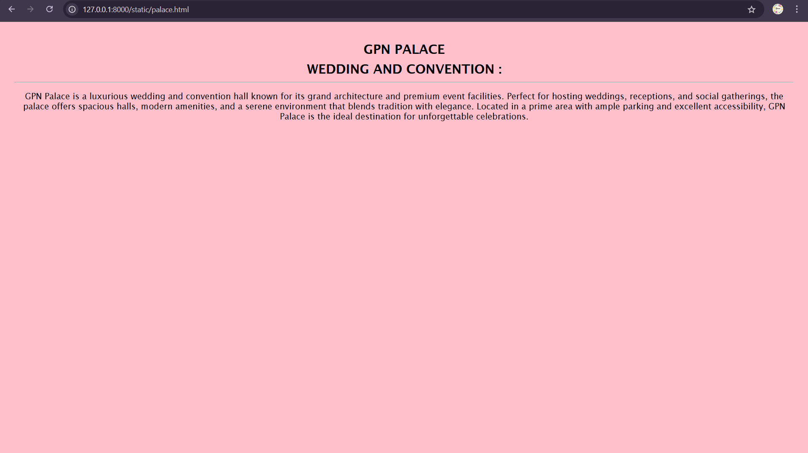
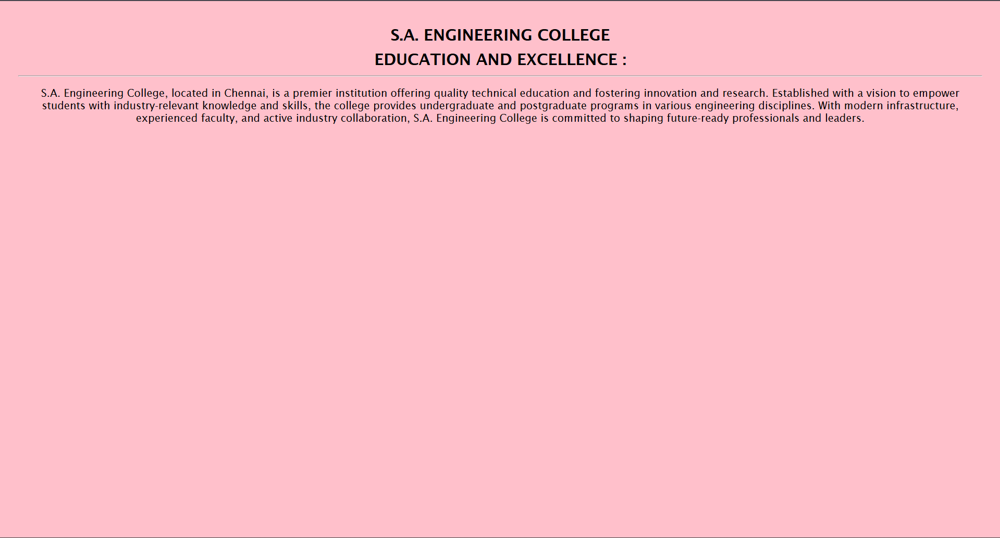
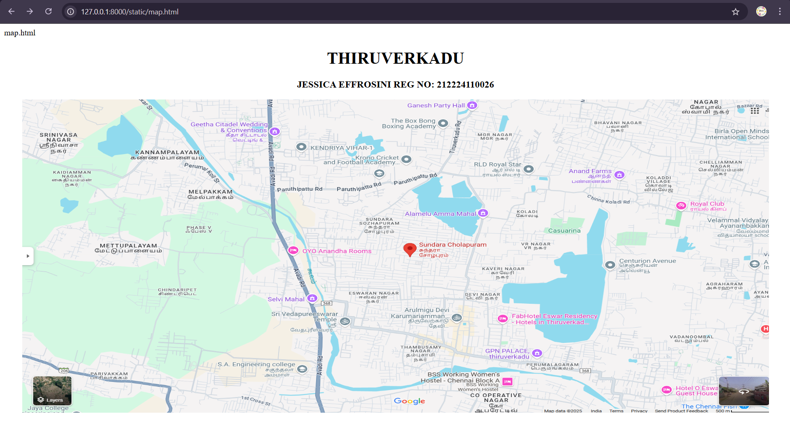

# Ex04 Places Around Me
## Date: 30.04.25

## AIM
To develop a website to display details about the places around my house.

## DESIGN STEPS

### STEP 1
Create a Django admin interface.

### STEP 2
Download your city map from Google.

### STEP 3
Using ```<map>``` tag name the map.

### STEP 4
Create clickable regions in the image using ```<area>``` tag.

### STEP 5
Write HTML programs for all the regions identified.

### STEP 6
Execute the programs and publish them.

## CODE
```
map.html

<html>
    <head>
        <title>My City</title>
    </head>
    <body>
        <center>
        <h1 >
        <font color="black" >THIRUVERKADU
  
        </font>
        </h1>
        <h3 > <font color ="black" > JESSICA EFFROSINI      REG NO: 212224110026 </font></h3>
        
            
            <map name="MyCity">
                <area shape="rect" coords="758,222,1040,320" href="home.html" title="MY HOME">
                <area shape="rect" coords="377,74,607,186" href="geetha.html" title="GEETHA CITADEL">
                <area shape="rect" coords="746,115,1028,213" href="mahal.html" title="ALAMELU MAHAL">
                <area shape="rect" coords="394,450,591,506" href="sa.html" title="S.A ENGINEERING">
                <area shape="rect" coords="820,464,1017,520" href="palace.html" title="GPN PALACE">       
            </map>
        </center>
    </body>
</html>

mahal.html

<!DOCTYPE html>
<html lang="en">
<head>
    <meta charset="UTF-8">
    <title>Alamelu Amma Mahal</title>
    <style>
        body {
            background-color: pink;
            font-family: 'Lucida Sans', 'Lucida Sans Regular', 'Lucida Grande', 
                         'Lucida Sans Unicode', Geneva, Verdana, sans-serif;
            text-align: center;
            padding: 20px;
        }

        h2 {
            margin: 10px 0;
        }

        hr {
            color: white;
        }
    </style>
</head>
<body>
    <h2>ALAMELU AMMA MAHAL</h2>
    <h2>WEDDING AND CONVENTION :</h2>
    <hr>
    <p>
        Alamelu Amma Mahal is a spacious and elegant wedding and convention hall ideal for grand celebrations 
        and important gatherings. Located in a well-connected area, it features modern amenities, air-conditioned halls, 
        and ample parking space, making it a convenient and luxurious choice for weddings, receptions, and corporate events. 
        With its blend of tradition and contemporary design, Alamelu Amma Mahal ensures a memorable experience for all guests.
    </p>
</body>
</html>
 
sa.html

<!DOCTYPE html>
<html lang="en">
<head>
    <meta charset="UTF-8">
    <title>S.A. Engineering College</title>
    <style>
        body {
            background-color: pink;
            font-family: 'Lucida Sans', 'Lucida Sans Regular', 'Lucida Grande', 
                         'Lucida Sans Unicode', Geneva, Verdana, sans-serif;
            text-align: center;
            padding: 20px;
        }

        h2 {
            margin: 10px 0;
        }

        hr {
            color: white;
        }
    </style>
</head>
<body>
    <h2>S.A. ENGINEERING COLLEGE</h2>
    <h2>EDUCATION AND EXCELLENCE :</h2>
    <hr>
    <p>
        S.A. Engineering College, located in Chennai, is a premier institution offering quality technical education 
        and fostering innovation and research. Established with a vision to empower students with industry-relevant 
        knowledge and skills, the college provides undergraduate and postgraduate programs in various engineering disciplines. 
        With modern infrastructure, experienced faculty, and active industry collaboration, S.A. Engineering College 
        is committed to shaping future-ready professionals and leaders.
    </p>
</body>
</html>

palace.html

<!DOCTYPE html>
<html lang="en">
<head>
    <meta charset="UTF-8">
    <title>GPN Palace</title>
    <style>
        body {
            background-color: pink;
            font-family: 'Lucida Sans', 'Lucida Sans Regular', 'Lucida Grande', 
                         'Lucida Sans Unicode', Geneva, Verdana, sans-serif;
            text-align: center;
            padding: 20px;
        }

        h2 {
            margin: 10px 0;
        }

        hr {
            color: white;
        }
    </style>
</head>
<body>
    <h2>GPN PALACE</h2>
    <h2>WEDDING AND CONVENTION :</h2>
    <hr>
    <p>
        GPN Palace is a luxurious wedding and convention hall known for its grand architecture and premium event facilities. 
        Perfect for hosting weddings, receptions, and social gatherings, the palace offers spacious halls, modern amenities, 
        and a serene environment that blends tradition with elegance. Located in a prime area with ample parking and excellent accessibility, 
        GPN Palace is the ideal destination for unforgettable celebrations.
    </p>
</body>
</html>

geetha.html

<!DOCTYPE html>
<html lang="en">
<head>
    <meta charset="UTF-8">
    <title>Geetha Citadel Wedding and Convention</title>
    <style>
        body {
            background-color: pink;
            font-family: 'Lucida Sans', 'Lucida Sans Regular', 'Lucida Grande', 
                         'Lucida Sans Unicode', Geneva, Verdana, sans-serif;
            text-align: center;
            padding: 20px;
        }

        h2 {
            margin: 10px 0;
        }

        hr {
            color: white;
        }
    </style>
</head>
<body>
    <h2>GEETHA CITADEL</h2>
    <h2>WEDDING AND CONVENTION :</h2>
    <hr>
    <p>
        Geetha Citadel Wedding and Convention is a premier event venue located in the heart of the city, 
        offering elegant and spacious halls for weddings, receptions, corporate events, and other celebrations. 
        With modern architecture, state-of-the-art facilities, and professional event services, 
        it is the perfect destination to host memorable functions. The venue provides ample parking, 
        excellent connectivity, and a serene ambiance that blends tradition with sophistication.
    </p>
</body>
</html>

home.html

<!DOCTYPE html>
<html lang="en">
<head>
    <meta charset="UTF-8">
    <title>My Hometown - Thiruverkaadu</title>
    <style>
        body {
            background-color: pink;
            font-family: 'Lucida Sans', 'Lucida Sans Regular', 'Lucida Grande', 
                         'Lucida Sans Unicode', Geneva, Verdana, sans-serif;
            text-align: center;
            padding: 20px;
        }

        h2 {
            margin: 10px 0;
        }

        hr {
            color: white;
        }
    </style>
</head>
<body>
    <h2>THIRUVERKAADU</h2>
    <h2>MY HOME TOWN :</h2>
    <hr>
    <p>
        Thiruverkaadu is my hometown, located in the western suburbs of Chennai, Tamil Nadu. 
        Known for the famous Thiruverkaadu Sri Vedapureeswarar Temple and the Devi Karumariamman Temple, 
        it is a spiritual and cultural hub. Over the years, Thiruverkaadu has developed into a well-connected residential area 
        with schools, shops, and public transport facilities. It is bordered by areas like Porur, Poonamallee, and Iyyappanthangal, 
        making it an accessible and peaceful locality to live in.
    </p>
</body>
</html>

```

## OUTPUT








## RESULT
The program for implementing image maps using HTML is executed successfully.
